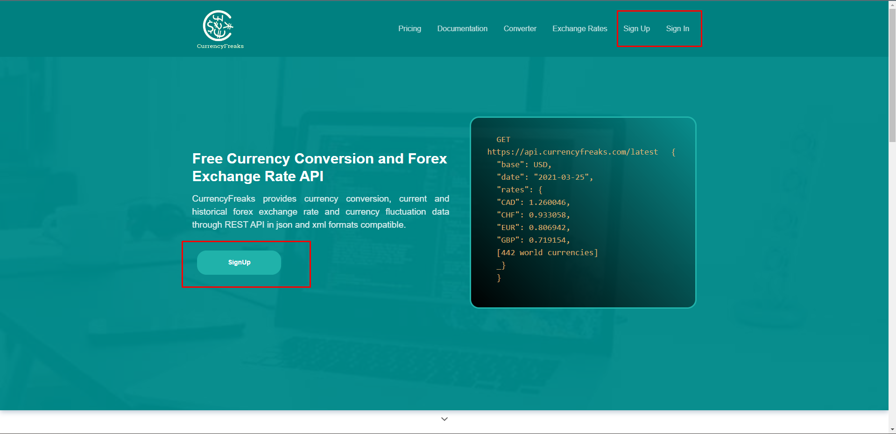
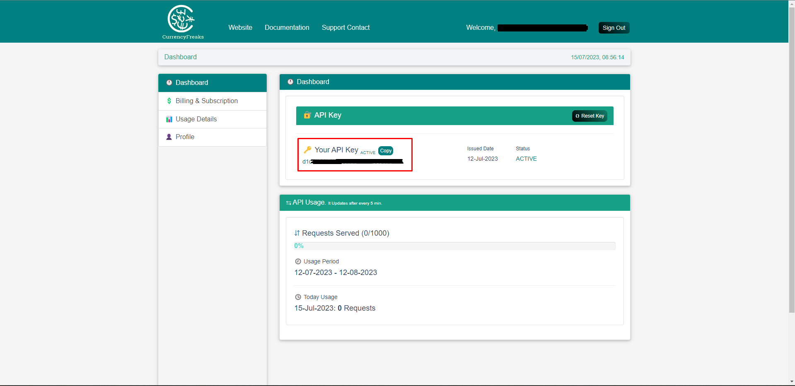
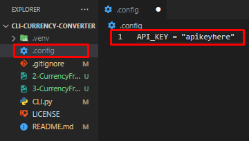

# cli-currency-converter
A CLI currency converter. This is my first project that uses an API (https://currencyfreaks.com/).
## Purpose of the Project
This will be my first time making use of an API in my code and is a fairly simple project to start with.
## The API - CurrenyFreaks
I will be using the CurrencyFreaks API (https://currencyfreaks.com/) for this project as it has a free plan which allows you to make 1000 requests a month. I found this API by using https://github.com/public-apis/public-apis which has a massive collection of free APIs to use. 

## API Key
### 1. How to Get a Key
To get an API key, you will need to sign up on https://currencyfreaks.com/. When you sign in, you will be presented with a dashboard that displays your API key.

(Homepage)

(Dashboard)
### 2. How to Set the Key
To use this code yourself, you will need to make some additions to the code. You will need to add a new file called `.config`. This file should be on the same hierarchical level as the other files. Inside `.config`, you will need to declare the constant `API_KEY` and store your key inside of it as a string. See the previous step to find out what your API key is.

## Things I Have Learnt From This Project
* Python environments
* How to use config files
* .gitignore